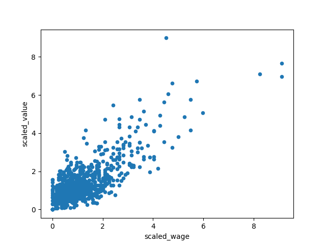

# Unsupervised Learning
Unsupervised learning happens when we have an unlabeled dataset

# Exploring
One good way of identifying the number of possible clusters in our data is to do a scatterplot
``` python
import matplotlib.pyplot as plt

plt.scatter(x,y)

plt.show()
```

# Cluster with Scipy
in this example, we cluster legendary Pokemons by x-y coordinates
```python
# Import linkage and fcluster functions
from scipy.cluster.hierarchy import linkage, fcluster

# Use the linkage() function to compute distance
Z = linkage(df, 'ward')

# Generate cluster labels
df['cluster_labels'] = fcluster(Z, 2, criterion='maxclust')

# Plot the points with seaborn
sns.scatterplot(x='x', y='y', hue='cluster_labels', data=df)
plt.show()
```
# K-means clustering with Scipy

- compute the centroids by defining two clusters
- assign cluster labels with `vq()`

```python
# Import kmeans and vq functions
from scipy.cluster.vq import kmeans, vq
# Compute cluster centers
centroids,_ = kmeans(df, 2)

# Assign cluster labels
df['cluster_labels'], _ = vq(df, centroids)

# Plot the points with seaborn
sns.scatterplot(x='x', y='y', hue='cluster_labels', data=df)
plt.show()
```
# Normalization of data
to normalize data, we divide by the standard deviaton

in scipy, this is done:
```python
from scipy.cluster import whiten

goals_for = [4,3,2,3,1,1,2,0,1,4]

#scaling
sacled_data=whiten(goals_for)

print(sacled_data)
```
# Visualise scaled data
we use matplotlib.pyplot ot viosualiize the data

we see that the Plotted scaled data and raw data look very similar

```python
# Plot original data
plt.plot(goals_for, label='original')

# Plot scaled data
plt.plot(scaled_data, label='scaled')

# Show the legend in the plot
plt.legend()

# Display the plot
plt.show()
```

# Normalization of small numbers
let's look at the normalization of small numbers
```python
# Prepare data
rate_cuts = [0.0025, 0.001, -0.0005, -0.001, -0.0005, 0.0025, -0.001, -0.0015, -0.001, 0.0005]

# Use the whiten() function to standardize the data
scaled_data = whiten(rate_cuts)

# Plot original data
plt.plot(rate_cuts, label='original')

# Plot scaled data
plt.plot(scaled_data, label='scaled')

plt.legend()
plt.show()
```
Scaled data for small numbers shows!!


So here we have to care for normalization.
# FIFA 18 data
Let's explore a dataset from FIFA 18. This dataset is from datacamp's Cliustering with Python couirse.

First, we set up our imports and data.
``` python
import pandas as pd
import matplotlib.pyplot as plt
from scipy.cluster.vq import vq, whiten 


fifa=pd.read_csv("data/fifa_18_sample_data.csv")

print(fifa.head())
```
Now, we can plot both normalized versions of the data
```python
fifa['scaled_wage']=whiten(fifa.eur_wage)
fifa['scaled_value']=whiten(fifa.eur_value)

fifa.plot(x='scaled_wage',y='scaled_value',kind='scatter' )

plt.show()
```

This looks like a positive correlation:


Cool :)

