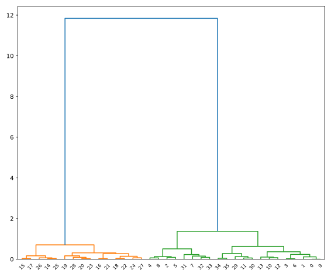

    Hierarchical Clustering
-----------


# Hierarchical clustering: ward
let's run clustering withu the 'ward' method and plot.

```python
# Import the fcluster and linkage functions
from scipy.cluster.hierarchy import fcluster, linkage

# Use the linkage() function
distance_matrix = linkage(comic_con[['x_scaled', 'y_scaled']], method = "ward", metric = 'euclidean')

# Assign cluster labels
comic_con['cluster_labels'] = fcluster(distance_matrix, 2, criterion='maxclust')

# Plot clusters
sns.scatterplot(x='x_scaled', y='y_scaled', 
                hue='cluster_labels', data = comic_con)
plt.show()
```


Basically:
- step 1: linkage (df,method: "ward", metric: "eucledian")
- step 2: fcluster(linkage, n_of_clusters, criterion: "maxclust")

# Hierarchical CLustering: Single Method
we do the same thing. Only this time, our clustering method is `single` istead of `ward`.

    Result:

Single and ward are similar.
# Hierarchical Clustering: Complete method
We do the same thing. Only this time our clustering method is `complete` instead of `single`


Coincidently, war, single and complete are the same in this example.

# Visualize clusters: matplotlib
we do a scatter plot with the XY coordinates in question.

The colors are sstored in a dictionary that isi accessed yhrouigh the lambda function `lambda x: dict[x]`

```python


# Import the pyplot class
import matplotlib.pyplot as plt 

# Define a colors dictionary for clusters
colors = {1:'red', 2:'blue'}

# Plot a scatter plot
comic_con.plot.scatter(x='x_scaled', 
                	   y='y_scaled',
                	   c=comic_con['cluster_labels'].apply(lambda x: colors[x])) #we defined the color names ina dictionary, then put it in a lambda funcction
plt.show()
```

# Visualizing in seaborn

Seaborn is similar to pyplot. but the author prefers seaborn for two reasons: simplicity and the templates of seaborn.


# How many clusters?
We draw a dendrogram to see the distances between our datapoints.

Choosing the number of cluster is more of an art than a science. *With the help of dendrograms*

# Creating a dendrogram
we feed the distance matrix to the dendrogram() function.
```python
# Import the dendrogram function
from scipy.cluster.hierarchy import dendrogram

# Create a dendrogram
dn = dendrogram(distance_matrix)

# Display the dendogram
plt.show()
```

now we have a plot to see

We might say that we need two clusters.

    I would go about it with a LOD way, Tableau style
# Limitation of hierarchical clustering
linkage is slow as datasets get bigger.
# FIFA 18: exploring defenders
Before doing the work, I need to prepare my dataset.
## Imports
    Best practice: put the imports on top
This doesn't necessarily mean that we should remember **ALL** of them at the beginning.
## scaling the points
I scale both datapoints with the `whiten` function:
```python
import matplotlib.pyplot as plt
from scipy.cluster.vq import whiten
import pandas as pd

fifa=pd.read_csv("data/fifa_18_dataset.csv")
sliding_tackle= fifa['sliding_tackle']
agression= fifa['aggression']

#scaling
sliding_tackle_scaled=whiten(sliding_tackle)
agression_scaled=whiten(agression)

# Plot original data
plt.plot(sliding_tackle, label='original')

# Plot scaled data
plt.plot(sliding_tackle_scaled, label='scaled')

# Show the legend in the plot
plt.legend()
plt.title("Sliding Tackle")
# Display the plot
plt.show()
```
This gives me:

Agression:
```python
plt.plot(agression, label='original')
plt.plot(agression_scaled, label='scaled')
plt.title("Agression")
plt.show()  
```

## Fitting the data with `linkage()`
Now, I input both scaled
```python
distance_matrix=linkage(fifa[['sliding_tackle_scaled','agression_scaled']],"ward") 
```
## Cluster data with `fcluster`
To get the clusters, we create a new column using the two columns and the distancematrix
```python
# Assign cluster labels to each row of data
fifa['cluster_labels'] = fcluster(distance_matrix, 3, criterion='maxclust')
```
## Display cluster centers of each cluster
```python
print(fifa[['scaled_sliding_tackle', 'scaled_aggression', 'cluster_labels']].groupby('cluster_labels').mean())
```
cluster_labels                                         
Centroid| x |y|
--- | ---| ---|
Cluster 1   | 0.987373   |       1.849142|
|Cluster 2 |                           3.013487        |  4.063492|
|Cluster 3  |                          1.934455  |        3.210802 |
## Create a scatter plot through seaborn
```python
sns.scatterplot(x='scaled_sliding_tackle', y='scaled_aggression', hue='cluster_labels', data=fifa)
plt.show()
```
The scatter plot with seaborn is elegantly beautiful.
